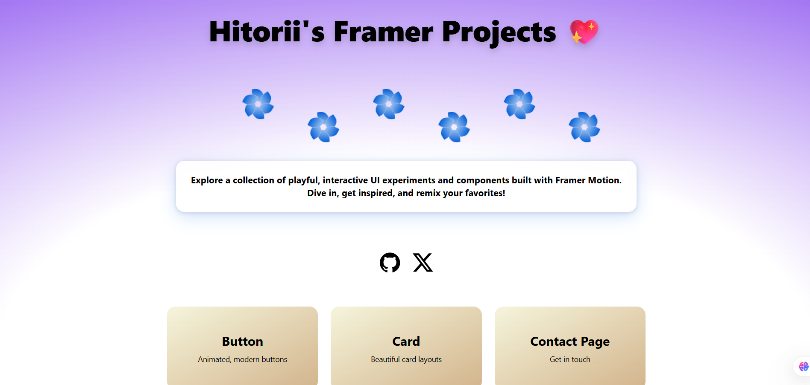

# Framer – Interactive UI Components with React, Vite & Tailwind

A playful collection of interactive UI experiments and components built with React, Vite, Tailwind CSS, and Framer Motion. Explore beautiful, animated elements like buttons and cards, and get inspired to remix or extend them for your own projects!


## Features

- ⚡️ **Vite** for lightning-fast development and HMR
- 🎨 **Tailwind CSS** for rapid, utility-first styling
- 🌀 **Framer Motion** for smooth, interactive animations
- 🧩 Modular, reusable **React components**
- 🗂️ Example pages: Animated Button, Card, and Box
- 🧹 Integrated ESLint and Prettier for code quality

---

## Preview



---

### Prerequisites

- [Node.js](https://nodejs.org/) (v14+ recommended)
- [npm](https://www.npmjs.com/) or [yarn](https://yarnpkg.com/)

### Installation

```bash
git clone https://github.com/hitoriiiiiiii/Framer.git
cd Framer
npm install
# or
yarn install
```

### Running the Development Server

```bash
npm run dev
# or
yarn dev
```

Visit [http://localhost:5173](http://localhost:5173) in your browser.

---

## Available Scripts

- `dev` – Start the development server
- `build` – Build the app for production
- `preview` – Preview the production build locally
- `lint` – Run ESLint for code quality

---

## Project Structure

```
.
├── public/                # Static assets
├── src/
│   ├── components/
│   │   └── card.jsx       # Card UI component
│   │   └── button.jsx     # Animated button component
│   │   └── box.jsx        # Box component
│   │   └── HomePage.jsx   # Home/landing page
│   │   └── App.jsx        # Main app with routing
│   └── Pages/
│       └── index.jsx      # Entry point
├── tailwind.config.js     # Tailwind CSS config
├── vite.config.js         # Vite config
├── eslint.config.js       # ESLint config
├── .prettierrc            # Prettier config
├── package.json           # Project metadata and scripts
└── README.md              # Project documentation
```

---

## Tech Stack

- [React](https://react.dev/)
- [Vite](https://vitejs.dev/)
- [Tailwind CSS](https://tailwindcss.com/)
- [Framer Motion](https://www.framer.com/motion/)
- [React Router](https://reactrouter.com/)
- [Lucide React](https://lucide.dev/) (icons)
- [ESLint](https://eslint.org/) & [Prettier](https://prettier.io/)

---

## Learn More

- [Framer Motion Documentation](https://www.framer.com/motion/)
- [Tailwind CSS Documentation](https://tailwindcss.com/)
- [Vite Documentation](https://vitejs.dev/)
- [React Documentation](https://react.dev/)

---
**Credits:**  
Created by [hitoriiiiiiii](https://github.com/hitoriiiiiiii)  
UI inspiration and code experiments with Framer Motion.
